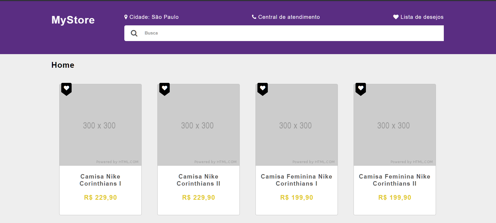

# 📌 Wishlist


## 📝 Descrição
Este é um teste demonstrativo da construção de duas
páginas simples com a funcionalidade de uma wishlist.
## 🚀 Demo

Link para demonstração

  
## 🛠 Tecnologia

### 👉 Client
- HTML
- JavaScript (Vanilla)
- SASS/SCSS
- Babel
- LocalStorage
- FontAwesome
- Responsividade

### 👉 Server
- Node
- Express
- Dotenv
- Node fetch

  
## ⤵️ Instalação

Clone o projeto e rode com npm:

```bash
  git clone https://github.com/gabrielleme00/wishlist
  cd wishlist
  npm install
  npm run start
```
    
## 🧱 Variáveis de Ambiente

Este projeto utiliza algumas variáveis no arquivo `.env`.
Há um arquivo `.env.example` para facilitar a sua criação.

São elas:
`PORT` e `ANOTHER_API_KEYPRODUCTS_API_URL`

  